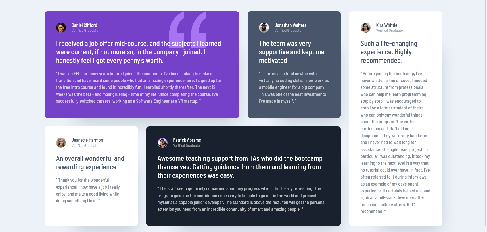
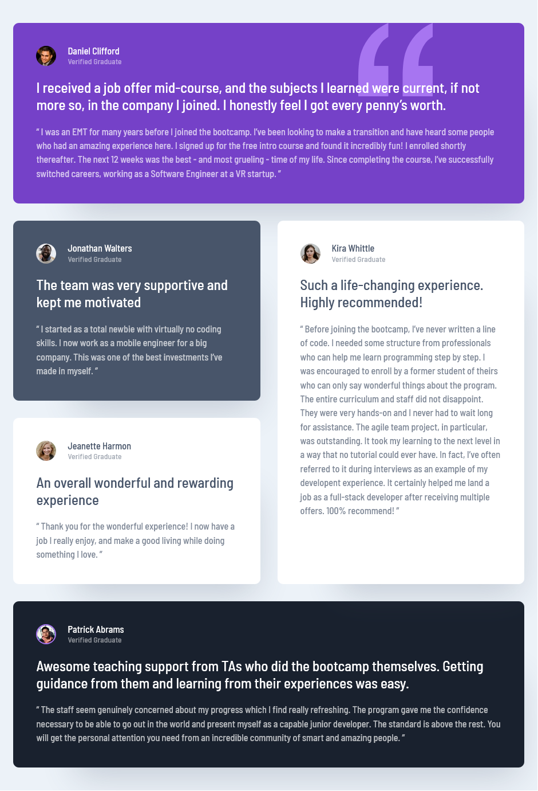
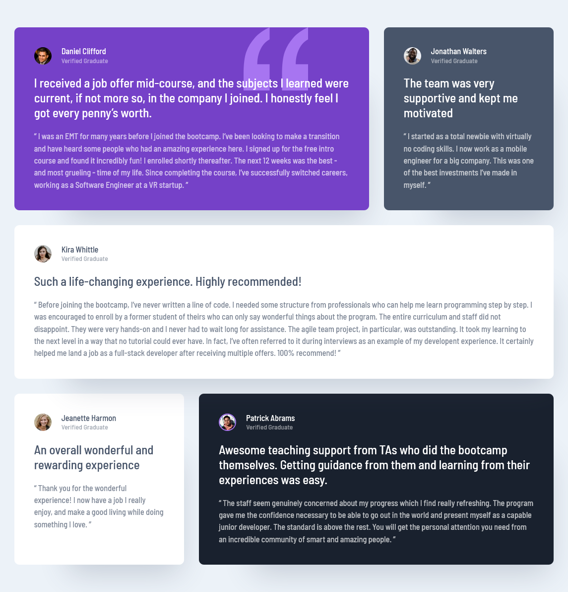
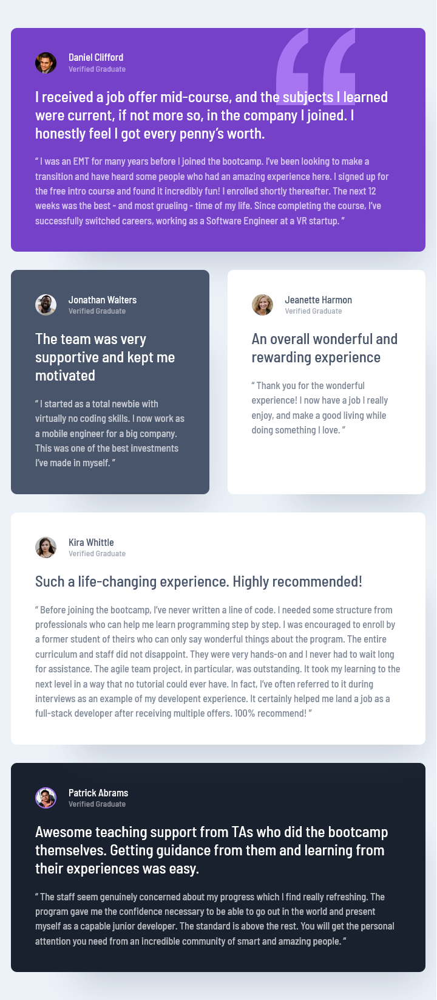
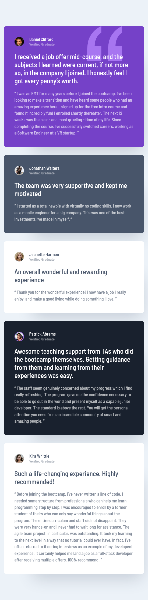

# Frontend Mentor - Testimonials grid section solution

This is a solution to the [Testimonials grid section challenge on Frontend Mentor](https://www.frontendmentor.io/challenges/testimonials-grid-section-Nnw6J7Un7). Frontend Mentor challenges help you improve your coding skills by building realistic projects.

## Table of contents

- [Overview](#overview)
  - [The challenge](#the-challenge)
  - [Solution](#solution-result)
  - [Links](#links)
- [My process](#my-process)
  - [Built with](#built-with)
  - [What I learned](#what-i-learned)
  - [Continued development](#continued-development)
  - [Useful resources](#useful-resources)
- [Author](#author)
- [Acknowledgments](#acknowledgments)

## Overview

### The challenge

Users should be able to:

- View the optimal layout for the site depending on their device's screen size

### Solution Result:



<!-- 


 -->

### Links

- Solution URL: [Add solution URL here](https://your-solution-url.com)
- Live Site URL: [Add live site URL here](https://your-live-site-url.com)

## My process

### Built with

- Semantic HTML5 markup
- CSS custom properties
- Flexbox
- CSS Grid
- Mobile-first workflow

### What I learned

The CSS reset showed me a new way of accessibility handling of some animation issues.

Remove all animations, transitions and smooth scroll for people that prefer not to see them.
```css
@media (prefers-reduced-motion: reduce) {
  html:focus-within {
    scroll-behavior: auto;
  }

  *,
  *::before,
  *::after {
    animation-duration: 0.01ms !important;
    animation-iteration-count: 1 !important;
    transition-duration: 0.01ms !important;
    scroll-behavior: auto !important;
  }
}
```
Plus, You can see i have used `em` instead of px unit in media queries, because it scales based on outside of HTML, and there are no issues with this.
```css
   @media screen and (min-width: 33em) {
  .testimonial-grid {
    grid-template-areas:
      "one one"
      "two three"
      "five five"
      "four four";
  }
}

@media screen and (min-width: 38em) {
  .testimonial-grid {
    grid-template-areas:
      "one one"
      "two five"
      "three five"
      "four four";
  }
}

@media screen and (min-width: 54em) {
  .testimonial-grid {
    grid-template-areas:
      "one one two"
      "five five five"
      "three four four";
  }
}

@media screen and (min-width: 75em) {
  .testimonial-grid {
    grid-template-areas:
      "one one two five"
      "three four four five";
  }
}
```


### Useful resources

- [CSS Reset](https://github.com/Lazzzer00/Best-CSS-Reset-2024) - This helped me for resetting CSS. I really liked this pattern and will use it going forward.
- [importable reset.css](https://github.com/mayank99/reset.css) - This will benefit to directly import in 1 line of code, saving time.

## Author

- Frontend Mentor - [@m-abubakr1](https://www.frontendmentor.io/profile/m-abubakr1)

## Acknowledgments

Inspiration of some approaches to complete this challenge came from Kevin Powell's Grid system video on youtube [Learn CSS Grid the easy way - Kevin Powell](https://www.youtube.com/watch?v=rg7Fvvl3taU), This video helped a lot in the end to make it more responsive.
